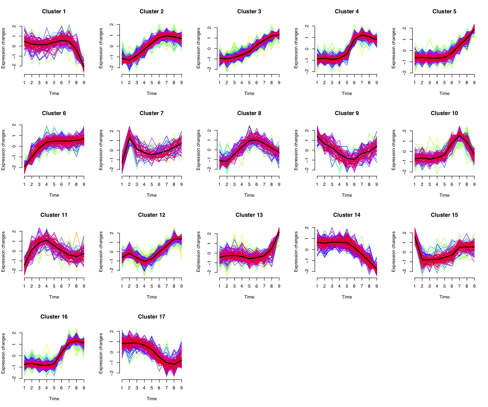
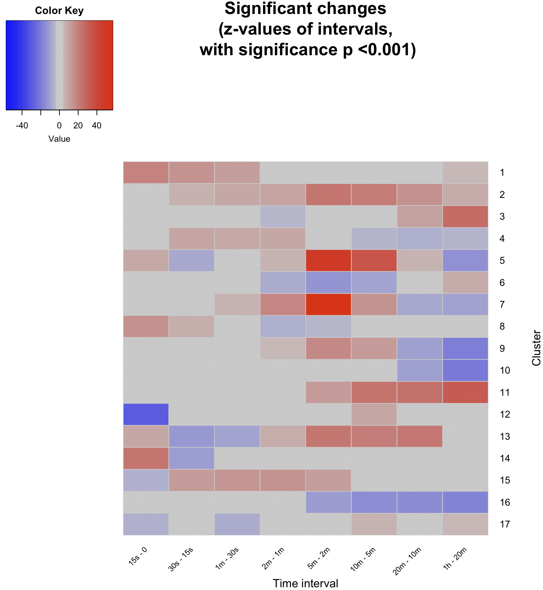
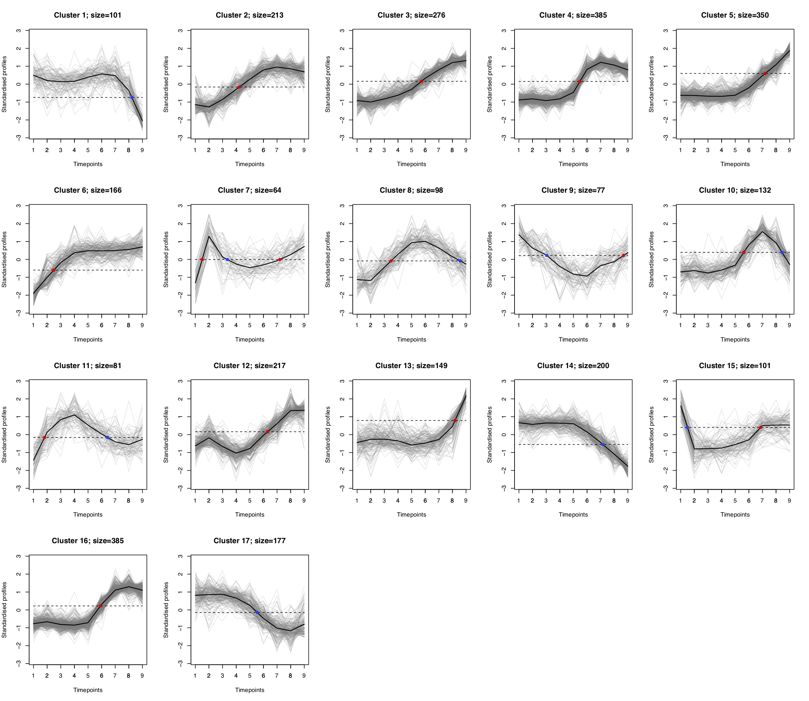
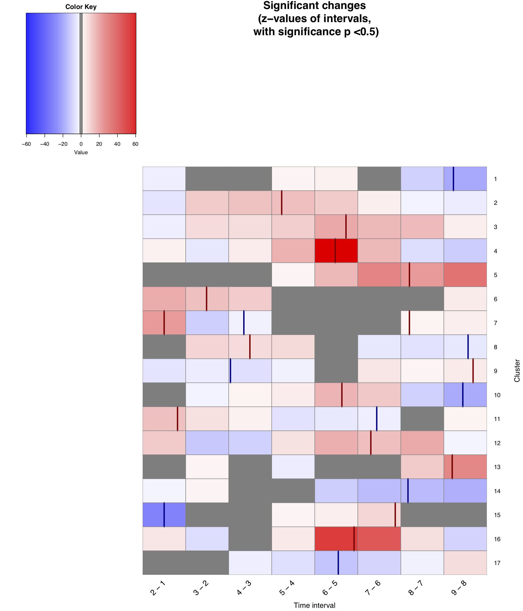
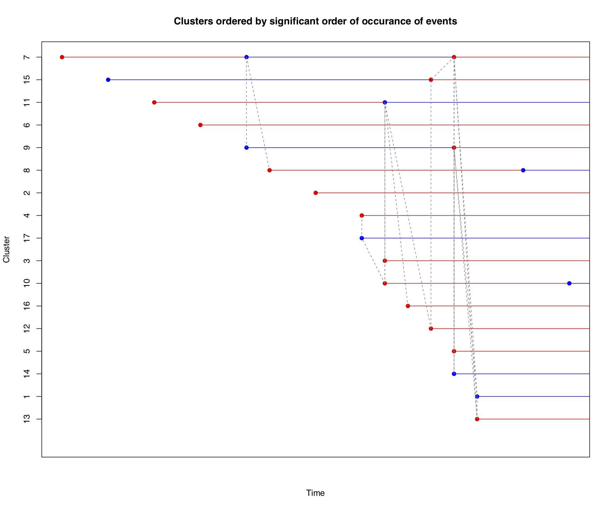
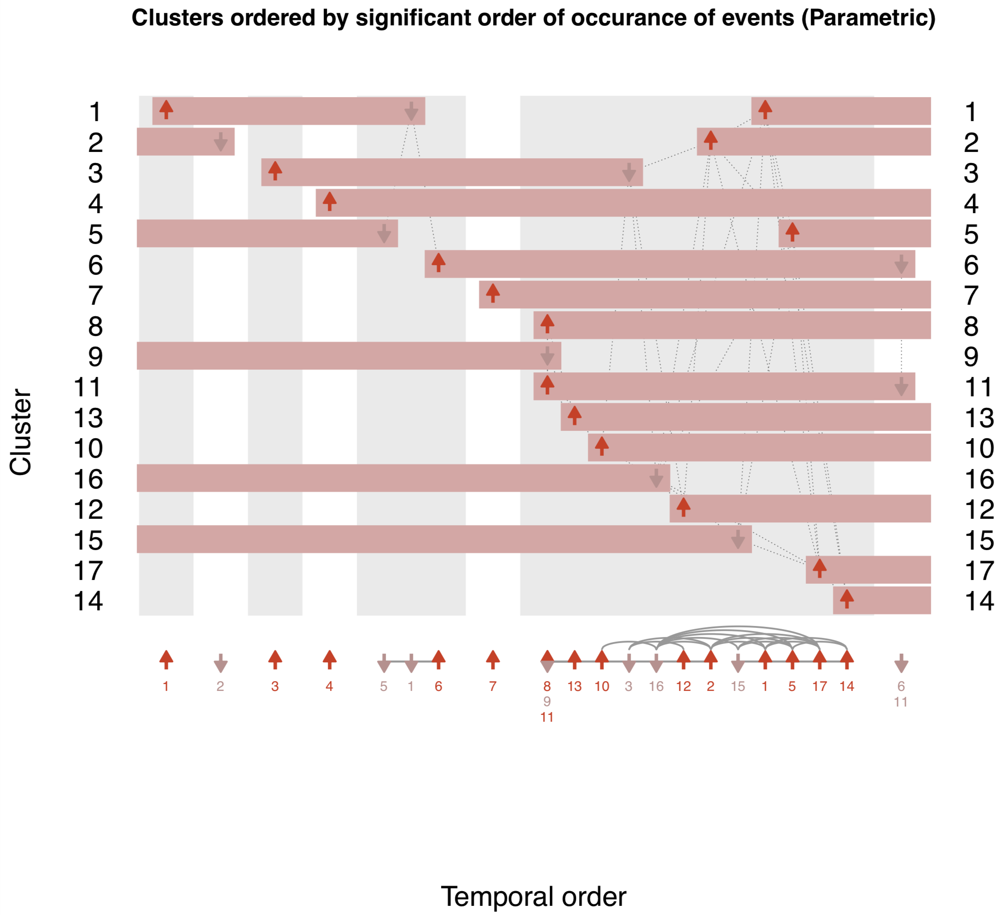
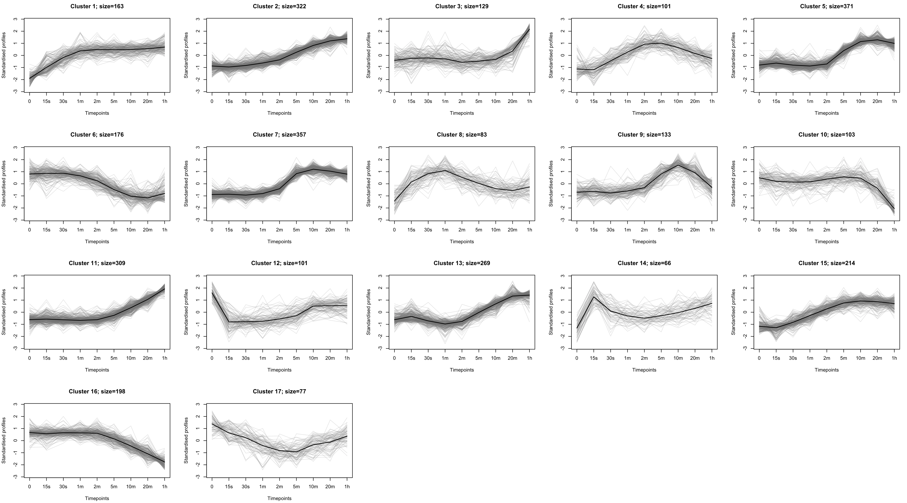

# MinardoModel

An R package for ordering of time-series clusters based on events.

This package provides three major analysis techniques for clusters:
1. Statistically evaluate change occurring in the time intervals within clusters.
2. Strategy for defining events (eg. phosphorylation and dephosphorylation) based on 50% abundance.  
3. Order and layout clusters based on the first occurrence of such events.

Furthermore, this package also presents an alternative colour scheme of cluster plot, which is based on a constant low opacity color.


The methods presented here can be applied to a wider variety of time-series high-throughput molecular biology datasets. In the rest of this document, application to a phosphoproteomics dataset is presented. For application to a gene expression dataset, follow [this link](workflowGE.md).


#### Prerequisite - Mfuzz

The MinardoModel package builds on clustered time-profiles. Time series phosphoproteomics datasets are generally clustered using the FCM algorithm, which is implemented in R in the Mfuzz package. Mfuzz is available through Bioconductor. If you don't have it installed, follow the instructions below, or follow the official website ([link](10.18129/B9.bioc.Mfuzz)).
```R
# Installing Mfuzz
source("https://bioconductor.org/biocLite.R")
biocLite()
biocLite("Mfuzz")
```


## Example workflow

### 1. Load the dataset and standardise it.
An example dataset taken from Humphrey *et al.* [1], contains phospho-proteomics profiles measured over 9 time-points (including basal).

```R

# Load the data
data(humphrey_noDup)
```

The loaded data contains 3,172 profiles. These profiles have been filtered from the originally published dataset [1] (which consisted of 37,248 profiles), as follows:

1. Phosphorylation changes were quantified at all measured time  points (i.e. values are present at all measured time points).
2. Sites were differentially altered (detemined by performing empirical Bayes modelling and moderated t-tests, followed by FDR correction).
3. At at-least one quantified time-point there is a 2-fold increase or 1/2-fold decrease.


#### Standardisation

These 3,172 profiles can be standardised as follows:

```R

# Standardise
tmp <- sweep(humphrey.noDup, 1, apply(humphrey.noDup, 1, mean), FUN="-")
humphrey.stand <- sweep(tmp, 1, apply(humphrey.noDup, 1, sd), FUN="/")
humphrey.stand <- as.matrix(humphrey.stand)
remove(tmp)
```

### 2. Generate clusters using Mfuzz
These standardised data are clustered using the Mfuzz package, as follows.

```R
# Load the Mfuzz library for clustering
library(Mfuzz)

# Do a clustering of the data (and specify the number of clusters)
clustered <- cmeans(humphrey.stand, centers=17,  iter.max=100, m=1.25)

# convert to an expression-set and plot using Mfuzz's plotting function
hum.stand.eset <- new("ExpressionSet", exprs=humphrey.stand)
mfuzz.plot2(hum.stand.eset, cl=clustered, mfrow=c(4,5), centre=TRUE)
```

Fig. 1: Cluster plots of 3,172 profiles from Humphrey *et al.*, generated using Mfuzz.


### 3. Evaluate change in the clusters

```R
# Create and run, for each cluster, a generalised linear model and carry out tukey post-hoc evaluations.
glmTukeyForEachClus <- calcClusterChng(humphrey.stand, clustered)

# Extract z-scores and p-values.
glmTukeyForEachClus.summary <- summaryGetZP(glmTukeyForEachClus, totalTimePoints=9)

# Plot the z-scores as a heat map.
resWithOnlySignif <- plotZP(glmTukeyForEachClus.summary)

```


Fig. 2: Heat map showing z-scores for each of the clusters (x-axis) at time-intervals (y-axis) with significant p-values. Z-scores at non-significant intervals have been greyed out.


### 4. Determine events

Phosphorylation and dephosphorylation are events, which occur when 50% abundance is crossed in the increasing or decreasing direction, respectively.

```
# Calculate the 50% crossings

mat_fiftyPoints <- calc50crossing(clustered)

```


Plotting the events on the cluster plot:

```
plotClusters_fifty(humphrey.stand, clustered, mat_fiftyPoints, plotNumCol=5)

```

Fig. 3: Cluster plots with phosphorylation and dephosphorylation events, shown via red and blue dots, respectively. The black dashed horizonal line indiates the 50% abundance of the centroid (the bold back line at the center of a cluster).


Plotting the events on the z-score heat map.

```

plotZP_fifty(glmTukeyForEachClus.summary, mat_fiftyPoints, 0.5)


```


Fig. 4: The time-interval change indicating heat map (see Fig. 2), which now also depicts phosphorylation and dephosphorylation events, via red and blue lines, respectively.


### 5. Ordered events

In the following function, an ordering of clusters is calculated, based on events (i.e. phosphorylation and dephosphorylation). A time distribution is generated for each cluster, and the distributions can be compared, either parametrically (t-tests) or non-parametrically (wilcox-test) to determine the ordering of these events, and thus clusters.


```
# Non-parametric test based ordering
orderTheEvents(humphrey.stand, clustered, mat_fiftyPoints, test="wilcox")
```

Fig. 5: Clusters ordered by first event (where the events were calculated non-parametrically). The events (depicted by dots), which are connected via gray dashed lines occur at the same time.

```
# Parametric test based ordering
orderTheEvents(humphrey.stand, clustered, mat_fiftyPoints, test="t-test")

```


Fig. 6: Clusters ordered by first event (where the events were calculated parametrically). Similarly to Fig. 5, the events (depicted by dots), which are connected via gray dashed lines occur at the same time. 


### 6. Plot clusters using a single hue colour scheme.

In general, a rainbow colour scheme (which is commonly used to plot time-series clusters, as seen in Fig. 1), can obscure discovery [2]. Since, the profiles in the rainbow colour scheme are coloured according to a single variable - the membership score - which ranges between 0 and 1 (lowest to highest), a monochromatic colour scheme is sufficient. Here, we provide an alternative colour scheme, which utilises a single hue for plotting the clusters, and adjust the opacity according to the membership score.

```R
# Plot clusters using a single hue colour scheme.
plotClusters(humphrey.stand, clustered)
```


Fig. 7: Cluster plots using a monochromatic colour scheme.


### References

1. Humphrey SJ, Yang G, Yang P, Fazakerley DJ, Stockli J, Yang JY, James DE. Dynamic adipocyte phosphoproteome reveals that Akt directly regulates mTORC2. Cell metabolism. 2013 Jun 4;17(6):1009-20.
2. O'Donoghue SI, Baldi BF, Clark SJ, Darling AE, Hogan JM, Kaur S, Maier-Hein L, McCarthy DJ, Moore WJ, Stenau E, Swedlow JR. Visualization of Biomedical Data. Annual Review of Biomedical Data Science. 2018 Jul 20;1:275-304.
