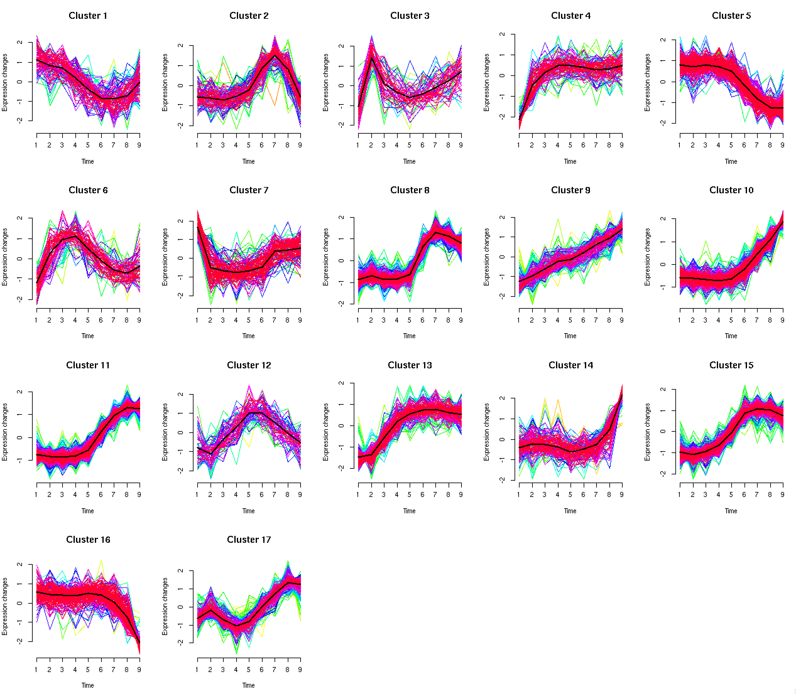
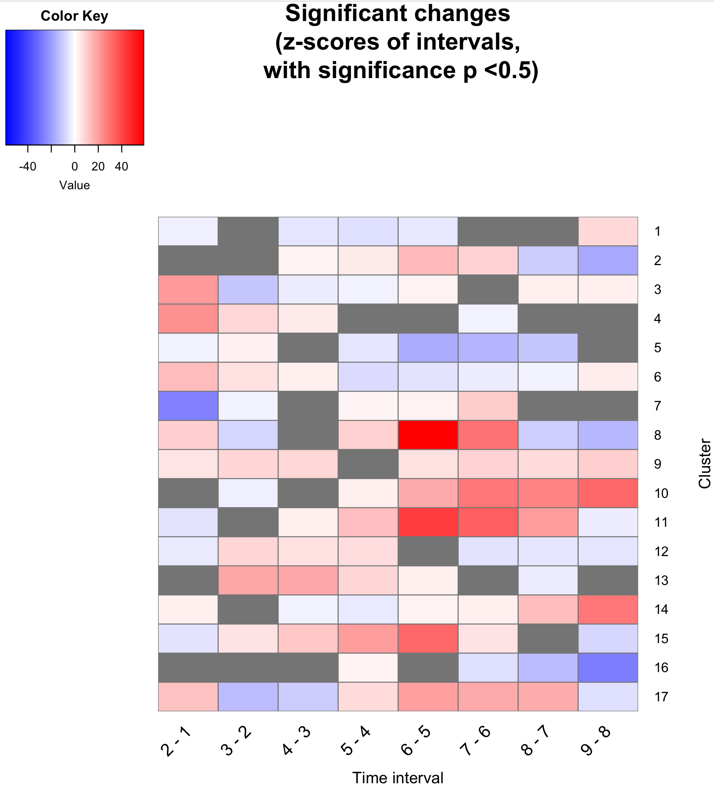
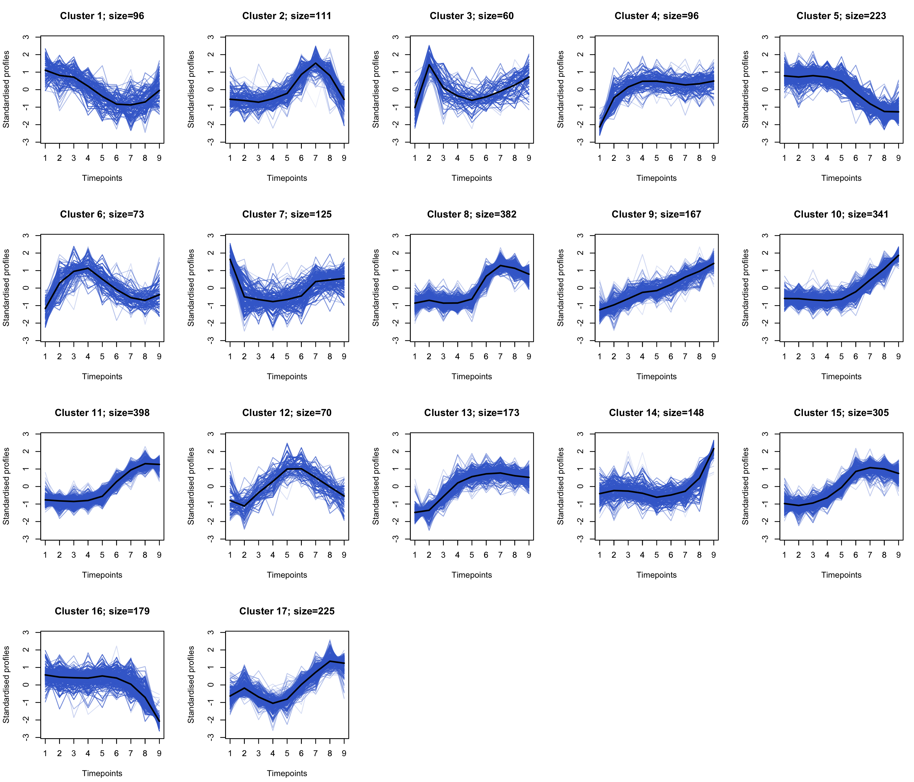

# MinardoModel

An R package for ordering of time-series clusters based on events.

This package provides two major features for further analysing clusters:
1. The ability to statistically evaluate change occurring in the time intervals of the clusters.
2. We provide strategies for defining events (eg. phosphorylation and dephosphorylation) based on 50% abundance.  

Furthermore, this paper also presents an alternative cluster plot based on a constant low opacity color.

The methods presented here can be applied to a wider variety of time-series high-throughput molecular biology datasets. Below is presented the application to a phosphoproteomics dataset. Workflow for application to gene expression datasets can be found in this [link](workflowGE.md).


#### Prerequisite - Mfuzz

The MinardoModel package builds on the clusters of time-profiles generated via the Mfuzz package, which implements the fuzzy c-means (FCM) clustering algorithm. It is available through Bioconductor. If you don't have it installed, follow the instructions below, or follow the official website ([link](10.18129/B9.bioc.Mfuzz)).
```R
# Installing Mfuzz
source("https://bioconductor.org/biocLite.R")
biocLite()
biocLite("Mfuzz")
```


## Example workflow

### 1. Load the dataset and standardise it.
An example dataset, taken from Humphrey *et al.* [1], contains phospho-proteomics profiles measured over 9 time-points (including basal).

```R

# Load the data
data(humphrey_noDup)
```

The loaded data contains 3172 profiles. These profiles have been filtered from the originally published dataset [1], as follows:

1. Phosphorylation changes were quantified at all measured time  points (i.e. values are present at all measured time points).
2. FDR correction was performed.
3. At at-least one quantified time-point there is a 2-fold increase or 1/2-fold decrease.


#### Standardisation

```R

# Standardise
tmp <- sweep(humphrey.noDup, 1, apply(humphrey.noDup, 1, mean), FUN="-")
humphrey.stand <- sweep(tmp, 1, apply(humphrey.noDup, 1, sd), FUN="/")
humphrey.stand <- as.matrix(humphrey.stand)
remove(tmp)
```

### 2. Generate clusters using Mfuzz

```R
# Load the Mfuzz library for clustering
library(Mfuzz)

# Do a clustering of the data (and specify the number of clusters)
clustered <- cmeans(humphrey.stand, centers=17,  iter.max=100, m=1.25)

# convert to an expression-set and plot using Mfuzz's plotting function
hum.stand.eset <- new("ExpressionSet", exprs=humphrey.stand)
mfuzz.plot2(hum.stand.eset, cl=clustered, mfrow=c(4,5), centre=TRUE)
```

Fig. 1: Clusters generated using Mfuzz.


### 3. Evaluate change in the clusters

```R
# Create and run, for each cluster, a generalised linear model and carry out tukey post-hoc evaluations.
glmTukeyForEachClus <- calcClusterChng(humphrey.stand, clustered)

# Extract z-scores and p-values.
glmTukeyForEachClus.summary <- summaryGetZP(glmTukeyForEachClus, totalTimePoints=9)

# Plot the z-scores as a heatmap.
resWithOnlySignif <- plotZP(glmTukeyForEachClus.summary)

```


Fig. 2: Heatmap showing z-scores for each of the clusters (x-axis) at time-intervals (y-axis) with significant p-values. Z-scores at non-significant intervals have been greyed out.


### 4. Determine events

Phosphorylation and dephosphorylation are events, which occur when 50% abundance is crossed in the increasing or decreasing direction, respectively.

```
# Calculate the 50% crossings

mat_fiftyPoints <- calc50crossing(clustered)

```


Plotting 50% on the cluster plot
```
plotClusters_fifty(humphrey.stand, clustered, mat_fiftyPoints, plotNumCol=5)

```

Fig. 3: Cluster plots with 50% crossing marked. The red indicate crossing in the upwards direction, hence phosphorylation and blue indicate crossing in the downwards direction, hence dephosphorylation.


Plotting 50% on the heatmap.

```
# Calculate segments of centroids and plot on heatmap.

plotZP_fifty(glmTukeyForEachClus.summary, mat_fiftyPoints, 0.5)


```

Fig. 4: Heatmap with 50% crossing points overlaid


### 5. Ordered events

In the following function, an ordering is calculated (i.e. those occurring at statistically significantly different times) and a figure is generated where the clusters are ordered by occurrence of first event.
```
# Non-parametric test based ordering
orderTheEvents(humphrey.stand, clustered, mat_fiftyPoints, test="wilcox")

# Parametric test based ordering
orderTheEvents(humphrey.stand, clustered, mat_fiftyPoints, test="t-test")

```

Fig. 5: Clusters ordered by first event.


### 6. Plot clusters using a single hue colour scheme.

In general, a rainbow colour scheme (which is commonly used to plot time-series clusters, as seen in Fig. 1), can obscure discovery [2]. Since, the profiles in the rainbow colour scheme are coloured according to a single variable - the membership score - which ranges between 0 and 1 (lowest to highest), a monochromatic colour scheme is sufficient. Here, we provide an alternative colour scheme, which utilises a single hue for plotting the clusters, and adjust the opacity according to the membership score.

```R
# Plot clusters using a single hue colour scheme.
plotClusters(humphrey.stand, clustered)
```


Fig. 6: Cluster plots using a monochromatic colour scheme.


### References

1. Humphrey SJ, Yang G, Yang P, Fazakerley DJ, Stockli J, Yang JY, James DE. Dynamic adipocyte phosphoproteome reveals that Akt directly regulates mTORC2. Cell metabolism. 2013 Jun 4;17(6):1009-20.
2. O'Donoghue SI, Baldi BF, Clark SJ, Darling AE, Hogan JM, Kaur S, Maier-Hein L, McCarthy DJ, Moore WJ, Stenau E, Swedlow JR. Visualization of Biomedical Data. Annual Review of Biomedical Data Science. 2018 Jul 20;1:275-304.
