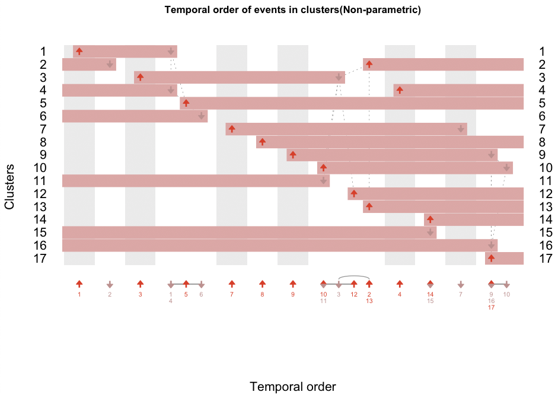

# MinardoModel

An R package for ordering of events identified from high-throughput time-series biomolecular data sets.

This package provides three major analysis techniques for clusters:
1. Statistically evaluate change occurring in the time intervals of each cluster.
2. Strategy for defining events (eg. phosphorylation and dephosphorylation).  
3. Temporally order events, and visualize this ordering.

The methods presented here can be applied to a wide variety of time-series high-throughput molecular biology datasets. We demonstrate application to a high-throughput time series [phosphoproteomics data set](./phospho.md), a time series [gene expression data set](./ge.md) and a combined [multiomics data set ordering](./multiomics.md).

### Inputs, Outputs

The input consists of a time series data set, and optional cluster labels. If you have not yet clustered your data, then the fuzzy c-means algorithm can be used (see next section).

The time series data can be a simple tab separated values file, e.g. [file](./RnaSeqData.txt).

This can be loaded into R as follows:
```R
rnaSeqStemClusData <- read.table('RnaSeqData.txt', header=TRUE, sep="\t", row.names=1)

head(rnaSeqStemClusData)
# Output:
#                          X0   X1h   X6h  X12h  X24h  X36h  X48h  X72h
# ENSMUSG00000000031:H19    0  0.38  0.47  0.55  1.87  2.78  4.18  4.34
# ENSMUSG00000000037:SCML2  0  0.64  0.92  0.74  0.75  0.71 -0.21 -1.13
# ENSMUSG00000000056:NARF   0 -0.41 -1.19 -0.70 -0.16 -0.73 -0.12 -0.02
# ENSMUSG00000000058:CAV2   0  0.02  0.00  0.07  0.07  0.08  0.47  1.33
# ENSMUSG00000000078:KLF6   0  0.58 -0.17 -0.69 -0.28 -1.10 -0.82  1.15
# ENSMUSG00000000093:TBX2   0  0.73 -0.19 -0.79 -1.10 -1.27 -1.12 -1.15


```

If you have already clustered your data, then the cluster format required by MinardoModel should be similar to the vector below.

If you have a [file](./rnaSeqClusters.txt) with cluster identifiers, it can be loaded into R as:
```R

rnaSeqClusters <- read.table("rnaSeqClusters.txt", header=TRUE, sep="\t", row.names=1)

head(rnaSeqClusters)
# Output: (Note the gene names correspond 1:1 with the time series data file)
#                          ClusNum
# ENSMUSG00000000031:H19         1
# ENSMUSG00000000037:SCML2      16
# ENSMUSG00000000056:NARF       17
# ENSMUSG00000000058:CAV2       12
# ENSMUSG00000000078:KLF6       12
# ENSMUSG00000000093:TBX2        2


# MinardoModel requires that clusters be supplied as a vector, this is one way to convert:
rnaSeqClusVec <- rnaSeqClusters[,1]
names(rnaSeqClusVec) <- rownames(rnaSeqClusters)

head(rnaSeqClusVec)
# Output:
#  ENSMUSG00000000031:H19 ENSMUSG00000000037:SCML2  ENSMUSG00000000056:NARF
#                       1                       16                       17
# ENSMUSG00000000058:CAV2  ENSMUSG00000000078:KLF6  ENSMUSG00000000093:TBX2
#                      12                       12                        2

```


The final output is visualisation of identified events as follows:

This is an example [ordering for a phosphoproteomics data set](./phospho.md)


This is an example [ordering for a multiomics data set](./multiomics.md).

These images depict the ordering of events using two types of visualisations: event maps (top) and event sparklines (bottom). In the event maps, each horizontal bar represents one cluster, and indicates when it has increased abundance. Each column (gray or white shading) indicates a group of events that occur at significantly different times to all other events. Events with the same horizontal positioning are assessed to occur simultaneously. Dotted gray lines indicate overlapping but non-simultaneous events. Event sparklines summarize the inferred temporal order of events shown in above event map.


#### Prerequisite - Mfuzz (for clustering)

The MinardoModel package builds on clustered time-profiles. If you have not clustered your time profiles, Mfuzz can be used. It implements the commonly utilized k-means and c-means algorithms. Mfuzz is available through Bioconductor. If you don't have it installed, follow the instructions below, or follow the official website ([link](https://doi.org/doi:10.18129/B9.bioc.Mfuzz)).

```R
# Installing Mfuzz
source("https://bioconductor.org/biocLite.R")
biocLite()
biocLite("Mfuzz")
```


#### Contact us

Any issues or additional suggestions are welcome. Please use the GitHub issue tracker or contact us at sandeep.kaur@unsw.edu.au.
