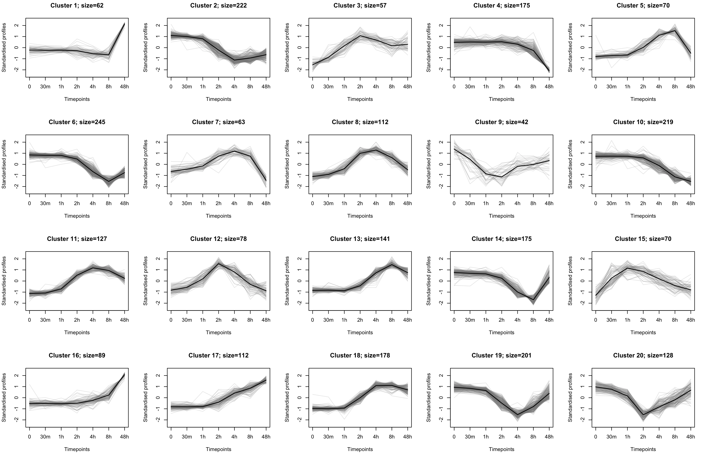
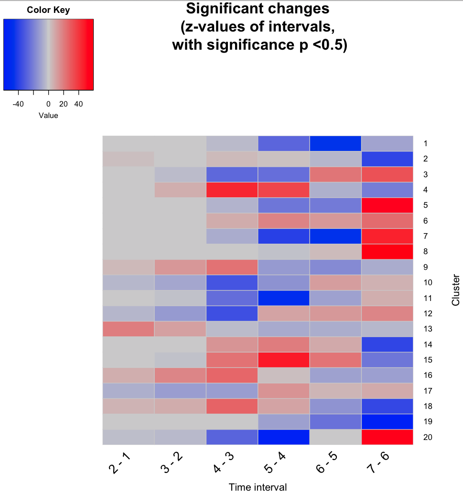
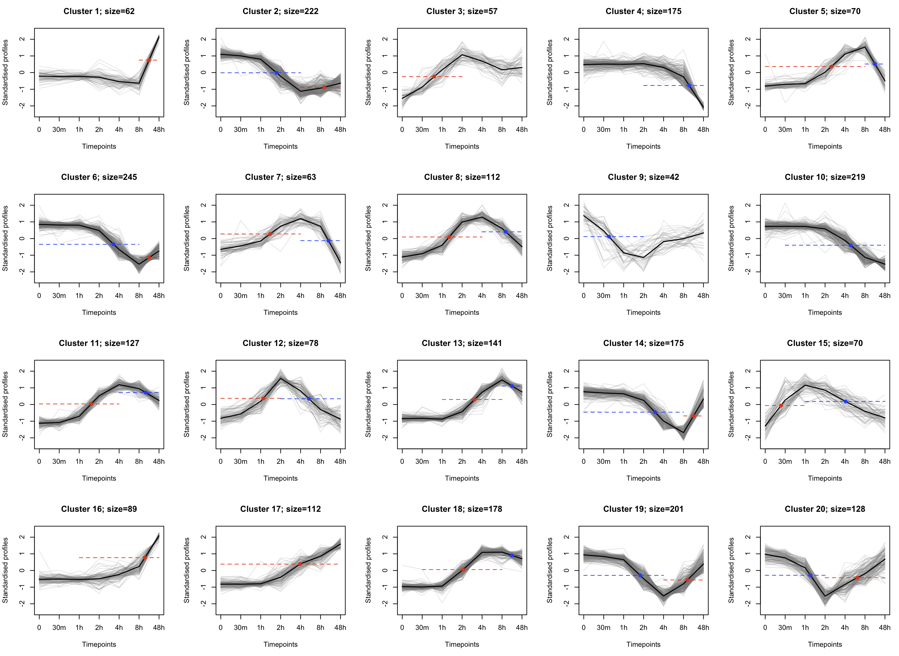
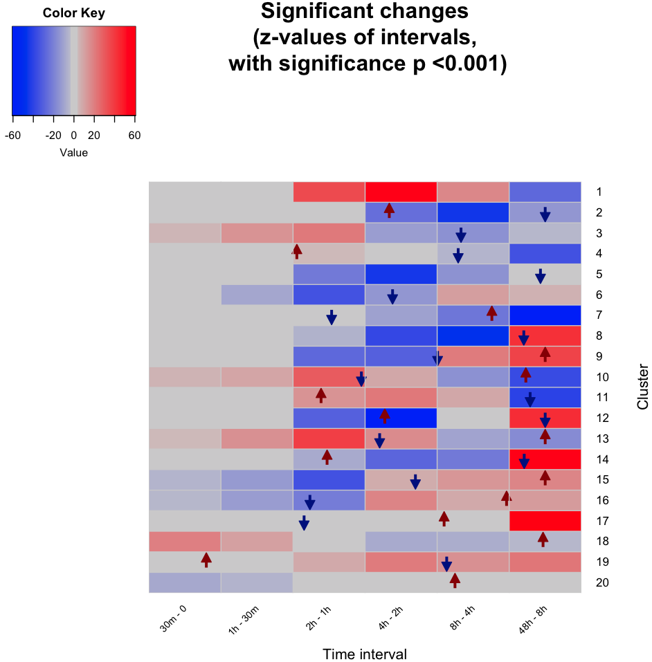
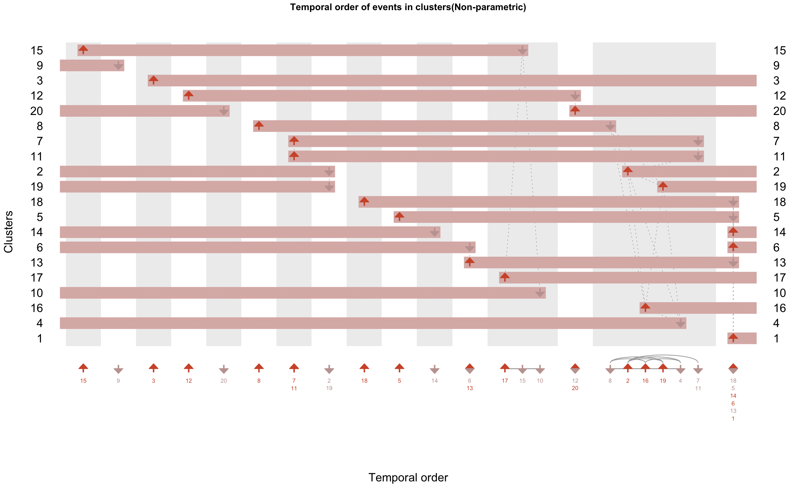
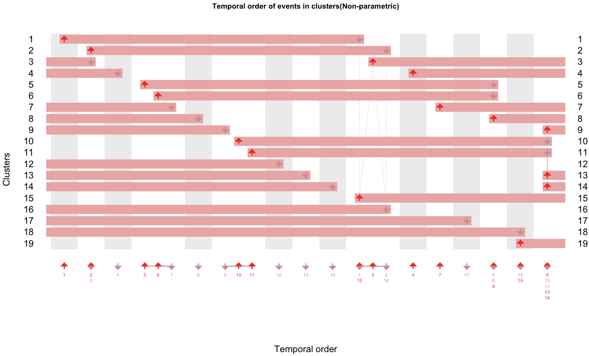

# Demonstration on a gene expression dataset

In this document, we demonstrate how our package can be utilised to order gene expression clusters.

### Dataset

We utilise the dataset made available by Ma *et al.* [1]. We downloaded the raw data from GEO (Gene Expression Omnibus) with the identifier GSE40565 and considered only the time-series arrays. We then obtained the differentially expressed genes from the seven time points (including basal) by following the section 'Microarray analysis' in Ma *et al.* [1]. This resulted in 2,566 profiles, which we make available as a sample dataset in this package.  

### Workflow

The work flow is very similar to the workflow for the time-series phosphoproteomics datasets.

#### 1. Load the dataset and standardise it

```R
# Load the data.
data(ge)


# Standardisation
tmp <- sweep(ge.temporal.changed, 1, apply(ge.temporal.changed, 1, mean), FUN="-")
ge.stand <- sweep(tmp, 1, apply(ge.temporal.changed, 1, sd), FUN="/")
ge.stand <- as.matrix(ge.stand)
remove(tmp)
```

#### 2. Clustering using Mfuzz
The next step is to cluster these data. For this data sets, we generate 20 clusters (as this number of clusters were shown to be optimal in the original article [1]).

We utilize the `cmeans` function made available by the Mfuzz package to partition these data.


```R
library(Mfuzz)

clustered <- cmeans(ge.stand, centers=20,  iter.max=500, m=1.25) # paper, 2014 Ma et al. partions into 20 clusters.

# Plotting the clusters
plotClusters(ge.stand, clustered)
```


Fig. 1: Clusters of gene expression dataset.  


#### 3. Quantifying change within clusters

To quantify which intervals are significantly changing and in which direction, regression can be made use of. The following functions utilize the `glm` function in the `stats` package, and model each cluster as a general linear model, followed by post-hoc Tukey contrasts for every interval.  

```R
# For each cluster, a linear model is formulated (where standardized ratio is the response) and time points along with profiles are predictors; the results of the post hoc tukey contrasting timepoints are presented.
glmTukeyForEachClus <- calcClusterChng(ge.stand, clustered)

# Summarizes and returns two matrices containing post hoc tukey z-scores and p-values for consecutive time intervals.
glmTukeyForEachClus.summary <- summaryGetZP(glmTukeyForEachClus, ge.stand)

# Returns heatmap plot and a matrix. The matrix contains z-scores for consecutive time points, where values above the significanceTh are set to NA
resWithOnlySignif <- plotZP(glmTukeyForEachClus.summary, significanceTh=0.001) ## See Fig. 2
```


Fig. 2: Heatmap showing z-scores for each of the clusters (x-axis) at time-intervals (y-axis) with significant p-values. Z-scores at non-significant intervals are shown in grey.

#### 4. Determine events

To calculate events, the first step involves calculating time regions. Time regions are calculated from Tukey contrasts (previous step). They are non-overlapping intervals with the maximal change, such that change in subintervals must also be in the the direction of the maximal change. The time regions can be filtered by either the z-score or the p-value or both.

It is within these time-regions that events are defined. For each type of event (increasing or decreasing) an abundance threshold defined, at which the event occurs. The threshold can be set to any value between 0 (minimal abundance for an increasing event, and vice versa for decreasing event) and 1 (maxmimal abundance for an increasing event, and vice versa for decreasing event) and reflects on the users intuition or understanding of the system, such as, what percent concentration must be attained for the involved genes to contribute to the underlying mechanisms.


In the example below however, for both gene expression and repression, the events are defined at the 50% standardized expression threshold.

```R
# Returns a list of matrices containing the computed time regions for each cluster.
timeRegions <- getTimeRegionsWithMaximalChange(glmTukeyForEachClus, 7, 0.05, phosZscoreTh=15, dephosZscoreTh=-15)


# Returns a matrix containing event information, computed for the cluster centroids.  
mat_events <- calcEvents(timeRegions, clustered)


# Running the function below is optional, its results may assist in updating thresholds to exclude/include events; It returns a matrix containing the number and percentage of profiles which get removed from an event's distribution because these profiles may not follow the general 'differences in means' direction.
mat_missingStats <- missingStats(ge.stand, clustered, mat_events, 0.5, 0.5)

 # Plot clusters with events overlaid (the events are computed for the cluster centroids).
plotClusters_withEvents(ge.stand, clustered, mat_events) ## See Fig. 3.

# Produces a heatmap with events marked, and returns a matrix (similar to the `plotZP` function).
resWithOnlySignif <- plotZP_withEvents(glmTukeyForEachClus.summary, mat_events, 0.001) ## See Fig. 4.

```

Fig. 3: The 20 clusters with 32 events overlaid.


Fig. 4: Heatmap of z-scores with events overlaid.

#### 5. Order filtered(/unfiltered events).
Order events (using mean (use `t-test`) or median (use `wilcox`)) & plot.

```R
# Returned is an object containing information regarding the event and cluster order.
theOrder <- calculateOrder(ge.stand, clustered, mat_events, "wilcox")

#The order is can then be plotted using event map and event sparkline.
visualizeOrder(theOrder) ## See Fig. 5.

```


Fig. 5: Event map (top) and event sparkline (bottom) showing the temporal order of events and clusters.


#### 6. Rearrange clusters

Once the order is generated, the clusters can then be rearranged. For this purpose we make available the function `rearrangeCluster`. This function mainly rearranges only two attributes of the `fclust` `clustered`
object, namely the `centers` and the `cluster`.


```R

# Returns the clustered object but with centers and cluster rearranged.
rearranged <- rearrangeClusters(clustered, theOrder)
```

Once rearranged, regenerate the event map and event sparkline to see the clusters numbered by occurrence of their corresponding first event.

```R
# Then, simply recompute everything with the new ordering, and clusters with the rearranged ordering can be visualized.
glmTukeyForEachClus <- calcClusterChng(ge.stand, rearranged)
glmTukeyForEachClus.summary <- summaryGetZP(glmTukeyForEachClus, ge.stand)

timeRegions <- getTimeRegionsWithMaximalChange(glmTukeyForEachClus, 7, phosZscoreTh=15, dephosZscoreTh=-15)
mat_events <- calcEvents(timeRegions, rearranged)


theOrder <- calculateOrder(ge.stand, rearranged, mat_events, "wilcox")
visualizeOrder(theOrder) ## See Fig. 6

# Additionally, cluster plots and heatmap plots can also be generated.
```



Fig. 6: Rearranged clusters and events (to reflect on the order of occurrence of events).


As a side note, generated images can be saved as pdf and the width and height adjusted:

```R
pdf("ge_dups_wilcox.pdf", width = 16, height=4)
plotClusters(ge.stand, clustered)
dev.off()
```


References

1. Ma, X., Yang, P., Kaplan, W.H., Lee, B.H., Wu, L.E., Yang, J.Y.H., Yasunaga, M., Sato, K., Chisholm, D.J. and James, D.E., 2014. ISL1 Regulates Peroxisome Proliferator-Activated Receptor gamma Activation and Early Adipogenesis via Bone Morphogenetic Protein 4-Dependent and-Independent Mechanisms. *Molecular and cellular biology*, 34(19), pp.3607-3617.
