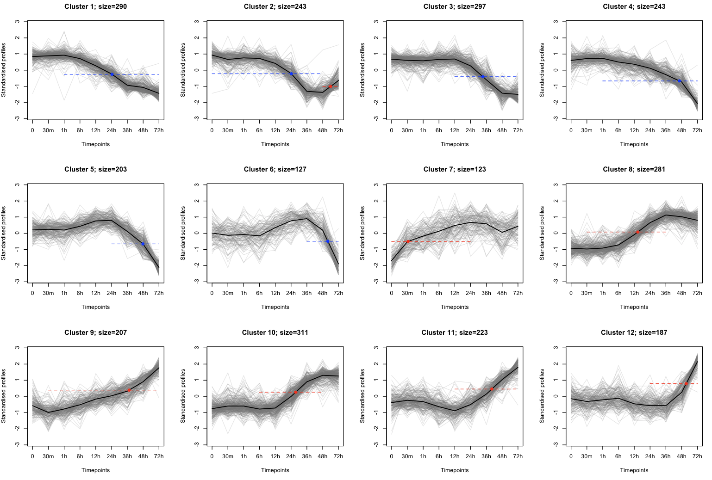
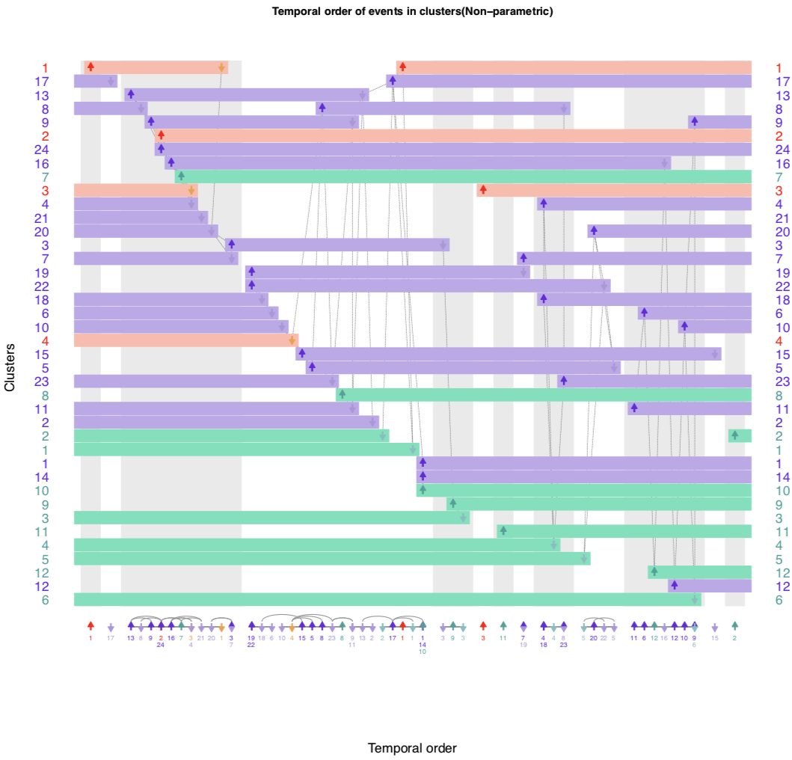

# Demonstration on a multiomics data set

## Data set

To demonstrate the utility of our method for multiomics, we utilize the data set made available by Yang *et al.* [1]. This data set comprises measurements of phosphoproteomics (12 time points, including basal), proteomics (9 time points, including basal) and transcriptomics (8 time points, including basal) as mouse E14Tg2a cells differentiated from embryonic stem cell (ESC) state to primed epiblast-like cells (EpiLC).


Yang *et al* partitioned 3,585 phosphosite profiles into 4 clusters and  2,735 proteomic profiles into 12 clusters using the FCM algorithm. The transcriptomic data were not partitioned into clusters by Yang *et al*. Hence, we used the STEM [2] tool and partitioned 6,225 transcriptomic profiles into 24 clusters (the details of this partition can be found in our paper [3]).

These three data sets, and the clusters are made available in the data variable `multiomics` here. For the phosphoproteomics data set, we make available 3,564 profiles i.e. 21 profiles were removed, since their corresponding protein name was not provided.  


## 1. Load the multiomics data sets and clusters

```R
# Loading the data
data(multiomics)

# Reveal the 6 variables:
ls()

# Output:
# [1] "phosClusVec"        "phosTsData.stand"   "protClusVec"       
# [4] "protTsData.stand"   "rnaSeqClusVec"      "rnaSeqTsData.stand"


# Inspect an element, e.g.:
head(phosTsData.stand)

# Output: (This is a matrix).
# 							0         5m         15m        30m          1h
# 1700013H16RIK;165; -1.3870962  1.3871597  1.27438354  0.8543833 -0.14139012
# 3110001I22RIK;78;  -1.5801288 -1.6521042 -0.14169328 -0.5497067  0.47095683
# 4931406P16RIK;935; -0.5180679  0.5484018  0.05412731  1.3776013  0.87323529
# 8030462N17RIK;66;   0.6300224  0.9482019  0.90781754  0.7354987  1.13234335
# 8030462N17RIK;143; -0.8469816  0.3771943  1.49351899  1.4655926  0.05079374
# 5031439G07RIK;293; -1.2070682 -0.4120892 -0.35512296 -1.3161767  1.26240004
# 3h         6h        12h         24h        36h
# 1700013H16RIK;165; -0.5546851 -1.1881867 -1.4737766  0.04645527  0.5420965
# 3110001I22RIK;78;   1.0196886  0.8027573  0.8332796  0.79030106  0.8967305
# 4931406P16RIK;935; -1.1362829 -0.2271252 -2.0126555 -0.80283973  0.1929319
# 8030462N17RIK;66;   0.9783879 -0.4314480 -1.5519969 -1.39064350 -0.7573558
# 8030462N17RIK;143;  0.3069489  0.3699914 -1.3516707 -1.44165194  0.8440603
# 5031439G07RIK;293;  0.7915390 -0.9262415  1.0679997  0.29259640  0.3600152
# 48h        72h
# 1700013H16RIK;165;  0.7590815 -0.1184253
# 3110001I22RIK;78;   0.2713140 -1.1613950
# 4931406P16RIK;935;  0.4191574  1.2315162
# 8030462N17RIK;66;  -0.9719895 -0.2288382
# 8030462N17RIK;143; -0.8647982 -0.4029977
# 5031439G07RIK;293; -1.0002018  1.4423500


head(phosClusVec)
# Output: (This is a vector).
# 1700013H16RIK;165;  3110001I22RIK;78; 4931406P16RIK;935;  8030462N17RIK;66;
#                 1                  2                  3                  4
# 8030462N17RIK;143; 5031439G07RIK;293;
#                 1                  2


```

The three omic data sets provided here have already been standardized.

## 2. Visualize the clusters

```R

# Plot phosphoproteomics clusters
plotClusters(phosTsData.stand, phosClusVec, plotNumCol=4) # See Fig. 1

# Similarly, plot transcriptomics clusters
plotClusters(protTsData.stand, protClusVec, plotNumCol=4) # See Fig. 2

# And, proteomics clusters
plotClusters(rnaSeqTsData.stand, rnaSeqClusVec) # See Fig. 3

```


Fig. 1: Phosphoproteomics clusters taken from the multiomics data set by Yang *et al*.


Fig. 2: Proteomics clusters taken from the multiomics data set by Yang *et al*.  


Fig. 3: Transcriptomics clusters from the multiomics data set by Yang *et al*. Here, the clusters were generated using the STEM tool.


## 3. Quantifying change within each omic clusters
```R
# phosphoproteomics
phos_glmTukey <- calcClusterChng(phosTsData.stand, phosClusVec)
phos_glmTukey_summary <- summaryGetZP(phos_glmTukey, phosTsData.stand)
plotZP(phos_glmTukey_summary) # see Fig. 4

# Transcriptomics
rna_glmTukey <- calcClusterChng(rnaSeqTsData.stand, rnaSeqClusVec)
rna_glmTukey_summary <- summaryGetZP(rna_glmTukey, rnaSeqTsData.stand)
plotZP(rna_glmTukey_summary) # See fig. 5

# Proteomics
prot_glmTukey <- calcClusterChng(protTsData.stand, protClusVec)
prot_glmTukey_summary <- summaryGetZP(prot_glmTukey, protTsData.stand)
plotZP(prot_glmTukey_summary) # see Fig. 6

```


Fig. 4: Heatmap indicating changes between consecutive timepoints in phosphoproteomic clusters. Increasing change is shown in red, and decreasing change in blue.


Fig. 5: Heatmap indicating changes between consecutive timepoints in transcriptomics clusters. Increasing change is shown in red, and decreasing change in blue.  


Fig. 6: Heatmap indicating changes between consecutive timepoints in proteomics clusters. Increasing change is shown in red, and decreasing change in blue.


## 4. Determine events for each ome
```R
# Phosphoproteomics
phos_eventWindows <- getTimeRegionsWithMaximalChange(phos_glmTukey, ncol(phosTsData.stand), 0.05, phosZscoreTh=15, dephosZscoreTh=-15)
phos_events <- calcEvents(phos_eventWindows, phosClusVec, phosTsData.stand)
# Plot phosphoproteomics events on heatmap and clusters
plotClusters_withEvents(phosTsData.stand, phosClusVec, phos_events, plotNumCol=4); # See Fig. 7
plotZP_withEvents(phos_glmTukey_summary, phos_events) # See Fig. 10 (Sorry, could not fit the legend).

# Transcriptomics
rna_eventWindows <- getTimeRegionsWithMaximalChange(rna_glmTukey, ncol(rnaSeqTsData.stand), 0.05, phosZscoreTh=15, dephosZscoreTh=-15)
rnaSeq_events <- calcEvents(rna_eventWindows, rnaSeqClusVec, rnaSeqTsData.stand)
# Plot transcriptomic events on heatmap and clusters
plotClusters_withEvents(rnaSeqTsData.stand, rnaSeqClusVec, rnaSeq_events, plotNumCol=4); # See Fig. 8
plotZP_withEvents(rna_glmTukey_summary, rnaSeq_events) # See Fig 11

# Proteomics
prot_eventWindows <- getTimeRegionsWithMaximalChange(prot_glmTukey, ncol(protTsData.stand), 0.05, phosZscoreTh=15, dephosZscoreTh=-15)
prot_events <- calcEvents(prot_eventWindows, protClusVec, protTsData.stand)
# Plot proteomics events on heatmap and clusters
plotClusters_withEvents(protTsData.stand, protClusVec, prot_events, plotNumCol=4); # See Fig 9
plotZP_withEvents(prot_glmTukey_summary, prot_events) # See Fig 12


## If you get an error saying 'figure margins too large', plot the image directly onto for example a pdf file (and view it), as follows:
pdf('phos_heatmap_events.pdf', height=3.8, width=20)
plotZP_withEvents(phos_glmTukey_summary, phos_events)
dev.off()


```


Fig. 7: Phosphorylation (red) and dephosphorylation (blue) events depicted on phosphoproteomic clusters.


Fig. 8: Transcription activation (red) and repression (blue) events depicted on transcriptomic clusters.


Fig. 8: Translation activation (red) and repression (blue) events depicted on proteomic clusters.


Fig. 10: Phosphorylation (red) and dephosphorylation (blue) events depicted on heatmap indicating change between consecutive timepoints in phosphoproteomic clusters.


Fig. 11:  Transcription activation (red) and repression (blue) events depicted on heatmap indicating change between consecutive timepoints in transcriptomic clusters.


Fig. 12:  Translation activation (red) and repression (blue) events depicted on heatmap indicating change between consecutive timepoints in proteomic clusters.  


## 5. Specify the measured time intervals

The phosphoproteomics measurements were made at *basal, 5m, 15m, 30m, 1h, 3h, 6h, 12h, 24h, 36h, 48h and 72h*. The proteomics measurements were made at *basal, 30m, 1h, 6h, 12h, 24h, 36h, 48h and 72h*.Finally the transcriptomics measurements were taken at *basal, 1h, 6h, 12h, 24h, 36h, 48h and 72h*. In MinardoModel, instead of using real time, we simplify the calculation of events to timepoints. Thus, events are calculated within an interval of points (in a linear scale), which can be easily converted to real time.

For the multiomics data sets, the time points at which the measurements were taken can be represented as below.


```R
phosTimeMap = c(1, 2, 3, 4, 5, 6, 7, 8, 9, 10, 11, 12)
mRnaTimeMap = c(1, 5, 7, 8, 9, 10, 11, 12)
protTimeMap = c(1, 4, 5, 7, 8, 9, 10, 11, 12)

```


## 6. Order all events combined
```R

# Combine all data in lists
list_tsData = list(phosTsData.stand, rnaSeqTsData.stand, protTsData.stand) # list of time series data.
list_clusters = list(phosClusVec, rnaSeqClusVec, protClusVec) # list of clusters
list_events = list(phos_events, rnaSeq_events, prot_events) # list of events

list_timeMap = list(phosTimeMap, mRnaTimeMap, protTimeMap) # list of time maps


# Calculate the order
res <- calculateOrder_combined(list_tsData, list_clusters, list_events, list_timeMap, 'wilcox')


# Visualize the order
pdf("combined_order.pdf", width=10, height=10)
visualizeOrder_combined(res) # See Fig. 13 (or the file images/Multiomics/combined_order.pdf).
dev.off()
```


Fig. 13: Order of phosphoproteomics, transcriptomics and proteomics events identified from the multiomics dataset. The phosphoproteomic events are shown in red, transcriptomic events are shown in purple, and protoemic events in green. Here, we can visually see, that phosphproteomic events generally precede transcriptomic events, which in turn precede proteomic events.

## 7. Rearranging clusters by event ordering

To rearrange cluster in the multiomic order, the each of the omics events will have to individually rearranged (similar to the instructions provided in step 6 [for the phosphoproteomics data set](./phospho.md)). The rearranged clusters can then be combined similar to the steps here. We leave this as an exercise for you - unless you'd really like some instructions ;). 
