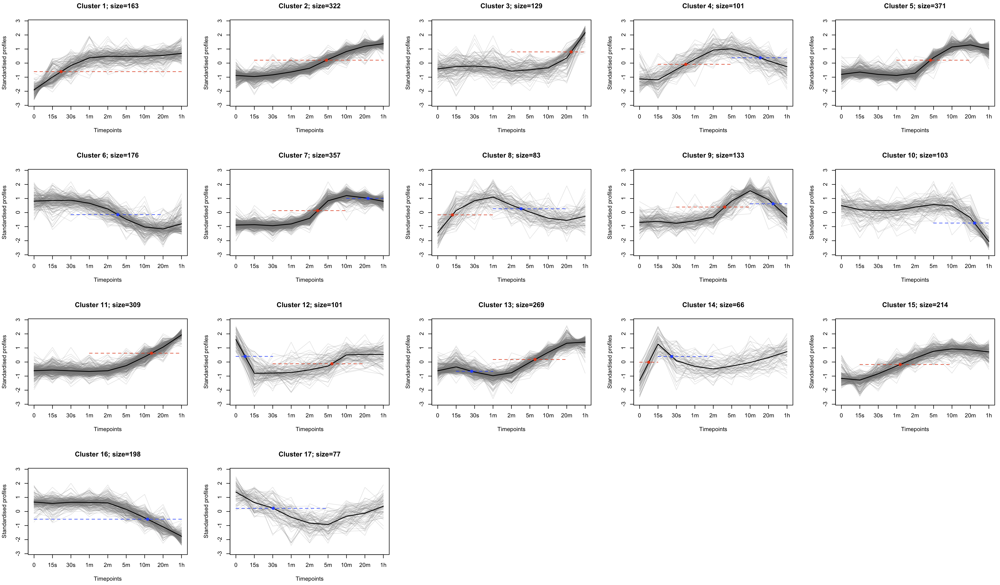
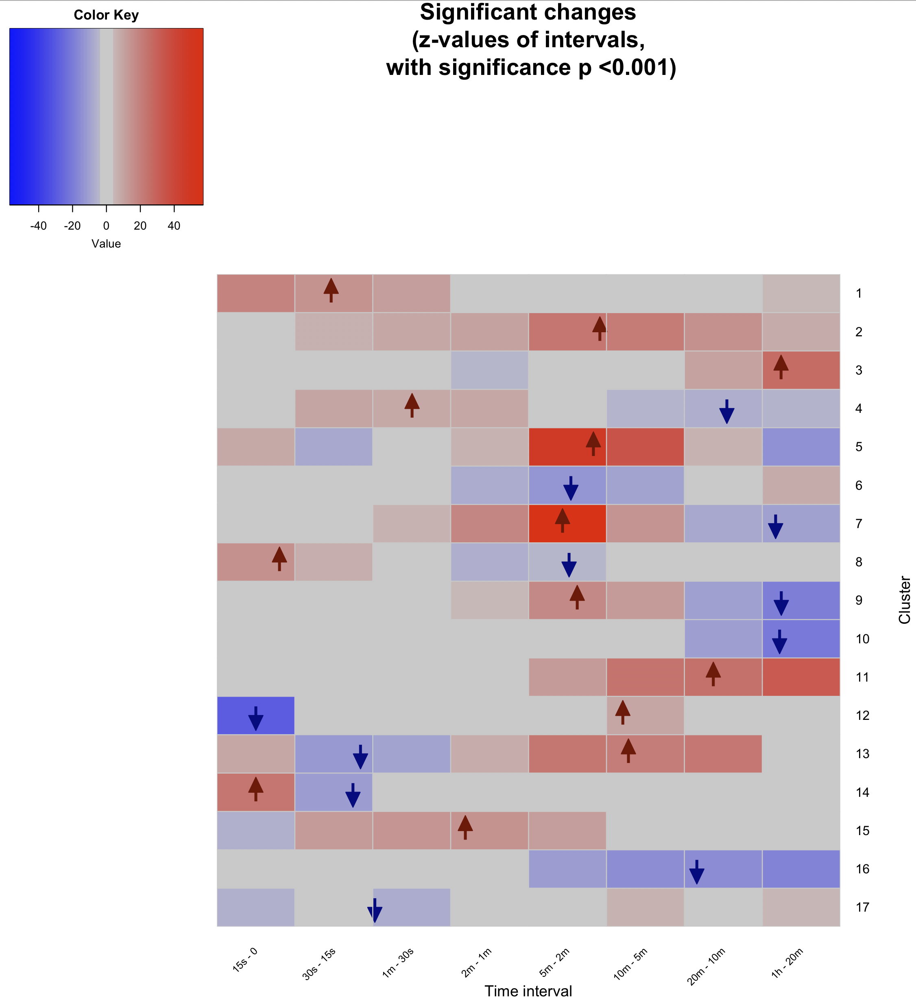
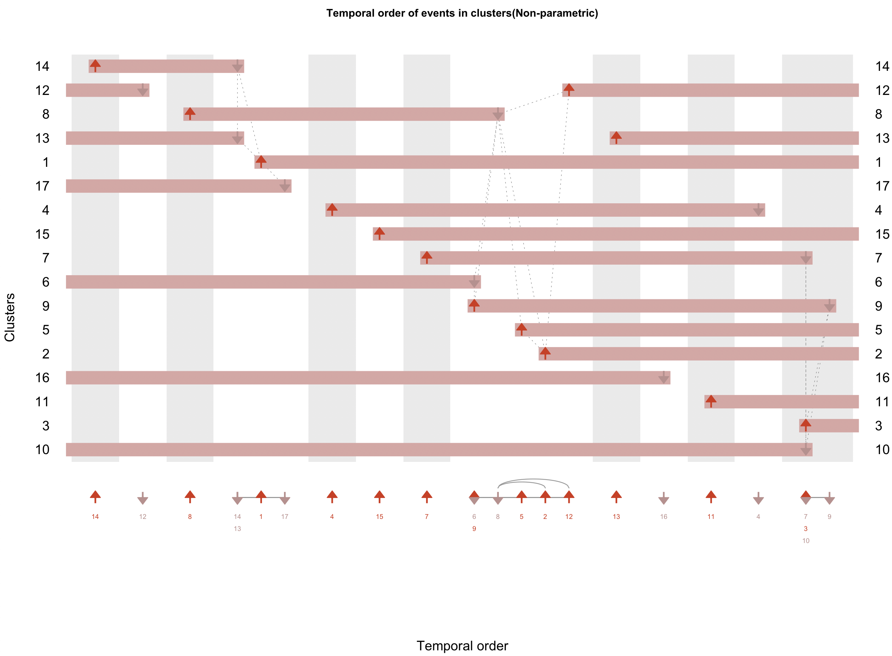
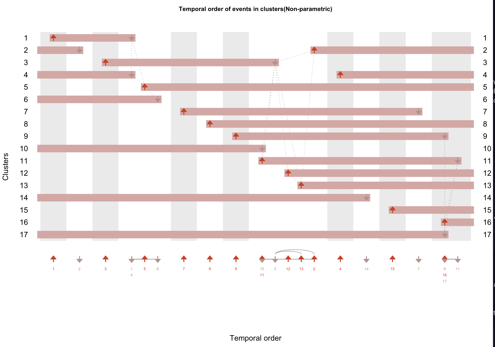

# Demonstration on a phosphoproteomics data set

### Data set

We utilise the data set made available by Humphrey *et al.* [1]. This data set measured the global cellular phosphoproteomics response to insulin stimulation. In total, 37,248 phosphosites were quantified, of which 3,172 were significantly changed in response to insulin. These profiles are provided in the dataset `humphrey`.


#### 1. Load the data set and standardise it

The first step is to load and standardize these data.

```R

# Loading the data
data(humphrey)

# Standardising it
tmp <- sweep(humphrey, 1, apply(humphrey, 1, mean), FUN="-")
humphrey.stand <- sweep(tmp, 1, apply(humphrey, 1, sd), FUN="/")
humphrey.stand <- as.matrix(humphrey.stand)
remove(tmp) # remove temporary variable
```

#### 2. Generate clusters
The next step is to cluster these data. For this data set, Yang et al. [2] showed that 17 clusters optimally partitioned these data.

The Mfuzz package provides a fuzzy c-means (FCM) algorithm to partition these data.

```R

library(Mfuzz)

# generate the clusters
clustered <- cmeans(humphrey.stand, centers=17, iter.max=200, m=1.25)

# plot the clusters
plotClusters(humphrey.stand, clustered) ## See Fig. 1
```


Fig. 1: Clusters of 3,172 phosphoproteomics profiles.  

#### 3. Quantifying change within clusters

To quantify which intervals are significantly changing and in which direction, regression can be made use of. The following functions utilize the `glm` function in the `stats` package, and model each cluster as a general linear model, followed by post-hoc Tukey contrasts for every interval.


Note that generalized linear models assume normality, hence, initially, check the pdf file generated by the `clusTpDistributions` function, which plots the distribution density of standandardized abundances for each cluster at every time point.


```R
# Generate a pdf containing the distributions of standandardized abundances at each time point for each cluster. Each distribution should be approximately normally distributed.
clusTpDistributions(humphrey.stand, clustered, outfile="humphrey_tpDist.pdf") # See example file: images/Humphrey/humphrey_tpDist.pdf).

# For each cluster, a linear model is formulated (where standardized ratio is the response) and time points along with profiles are predictors; the results of the post hoc tukey contrasting timepoints are presented.
glmTukeyForEachClus <- calcClusterChng(humphrey.stand, clustered)

# Summarizes and returns two matrices containing post hoc tukey z-scores and p-values for consecutive time intervals.
glmTukeyForEachClus.summary <- summaryGetZP(glmTukeyForEachClus, humphrey.stand)

# Returns heatmap plot and a matrix. The matrix contains z-scores for consecutive time points, where values above the significanceTh are set to NA
resWithOnlySignif <- plotZP(glmTukeyForEachClus.summary, significanceTh=0.001) ## See Fig. 2
```


Fig. 2: Heatmap of z-scores.


#### 4. Determine events

To calculate events, the first step involves calculating time regions. Time regions are calculated from Tukey contrasts (previous step). They are non-overlapping intervals with the maximal change, such that change in subintervals must also be in the the direction of the maximal change. The time regions can be filtered by either the z-score or the p-value or both.

It is within these time-regions that events are defined. For each type of event (increasing or decreasing) an abundance threshold defined, at which the event occurs. The threshold can be set to any value between 0 (minimal abundance for an increasing event, and vice versa for decreasing event) and 1 (maxmimal abundance for an increasing event, and vice versa for decreasing event) and reflects on the users intuition or understanding of the system, such as what percent saturation must be attained for the involved phosphosites to contribute to the underlying mechanisms. For example, 30% phosphorylation of a site may be considered enough for the site's corresponding protein to affect downstream proteins.

In the example below however, for both phosphorylation and dephosphorylation, the events are defined at the 50% standardized abundance threshold.

```R
# Returns a list of matrices containing the computed time regions for each cluster.
timeRegions <- getTimeRegionsWithMaximalChange(glmTukeyForEachClus, 9, 0.05, phosZscoreTh=15, dephosZscoreTh=-15)


# Returns a matrix containing event information, computed for the cluster centroids.  
mat_events <- calcEvents(timeRegions, clustered)


# Running the function below is optional, its results may assist in updating thresholds to exclude/include events; It returns a matrix containing the number and percentage of profiles which get removed from an event's distribution because these profiles may not follow the general 'differences in means' direction.
mat_missingStats <- missingStats(humphrey.stand, clustered, mat_events, 1, 1)

 # Plot clusters with events overlaid (the events are computed for the cluster centroids).
plotClusters_withEvents(humphrey.stand, clustered, mat_events) ## See Fig. 3.

# Produces a heatmap with events marked, and returns a matrix (similar to the `plotZP` function).
resWithOnlySignif <- plotZP_withEvents(glmTukeyForEachClus.summary, mat_events, 0.001) ## See Fig. 4.
```


Fig. 3: The 17 clusters with 24 events overlaid.


Fig. 4: Heatmap of z-scores with events overlaid.


#### 5. Order filtered(/unfiltered events).
Order events (using mean (use `t-test`) or median (use `wilcox`)) & plot. To determine which test to use, again visually inspect the pdf file generated by the `eventDistributions` function. If the distributions are approximately normally, then use the `t-test`, otherwise use the `wilcox` test.

```R
# Plots distributions of event times for events in each cluster
eventDistributions(humphrey.stand, clustered, mat_events, 0.5, 0.5, outfile="humphrey_eventDist.pdf"); # See file: images/Humphrey/humphrey_eventDist.pdf

# Returned is an object containing information regarding the event and cluster order.
theOrder <- calculateOrder(humphrey.stand, clustered, mat_events, "wilcox")

#The order is can then be plotted using event map and event sparkline.
visualizeOrder(theOrder) ## See Fig. 5.

```


Fig. 5: Event map (top) and event sparkline (bottom) showing the temporal order of events and clusters.


#### 6. Rearrange clusters

Once the order is generated, the clusters can then be rearranged. For this purpose we make available the function `rearrangeCluster`. This function mainly rearranges only two attributes of the `fclust` `clustered`
object, namely the `centers` and the `cluster`.


```R

# Returns the clustered object but with centers and cluster rearranged.
rearranged <- rearrangeClusters(clustered, theOrder)
```

Once rearranged, regenerate the event map and event sparkline to see the clusters numbered by occurrence of their corresponding first event.

```R
# Then, simply recompute everything with the new ordering, and clusters with the rearranged ordering can be visualized.
glmTukeyForEachClus.rearranged <- calcClusterChng(humphrey.stand, rearranged)
glmTukeyForEachClus.summary.rearranged <- summaryGetZP(glmTukeyForEachClus.rearranged, humphrey.stand)

timeRegions.rearranged <- getTimeRegionsWithMaximalChange(glmTukeyForEachClus.rearranged, 9, phosZscoreTh=15, dephosZscoreTh=-15)
mat_events.rearranged <- calcEvents(timeRegions.rearranged, rearranged)


theOrder.rearranged <- calculateOrder(humphrey.stand, rearranged, mat_events.rearranged, "wilcox")
visualizeOrder(theOrder.rearranged) ## See Fig. 6

# Additionally, cluster plots and heatmap plots can also be generated.
```


Fig. 6: Rearranged clusters and events (to reflect on the order of occurance of events).


#### References

1. Humphrey, S. J., Yang, G., Yang, P., Fazakerley, D. J., Stöckli, J., Yang, J. Y., & James, D. E. (2013). Dynamic adipocyte phosphoproteome reveals that Akt directly regulates mTORC2. *Cell metabolism*, 17(6), 1009-1020.
2. Yang, P., Zheng, X., Jayaswal, V., Hu, G., Yang, J. Y. H., & Jothi, R. (2015). Knowledge-based analysis for detecting key signaling events from time-series phosphoproteomics data. *PLoS computational biology*, 11(8), e1004403.
