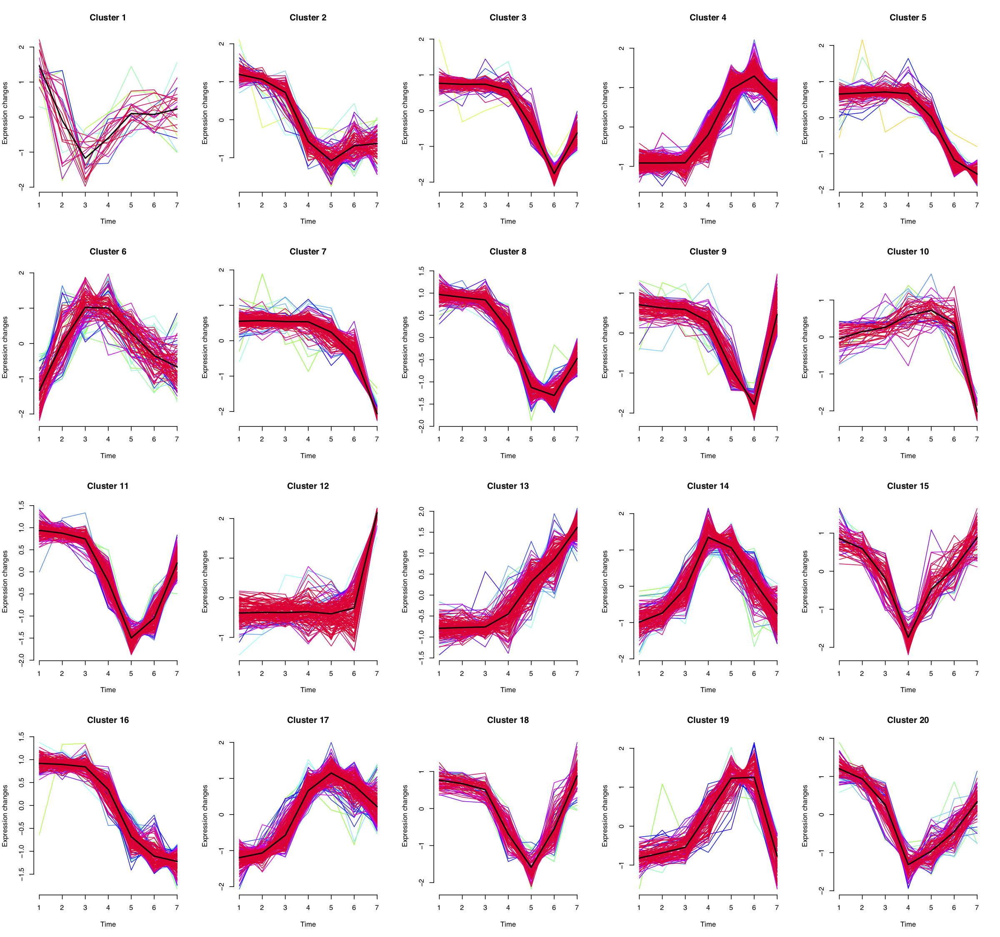
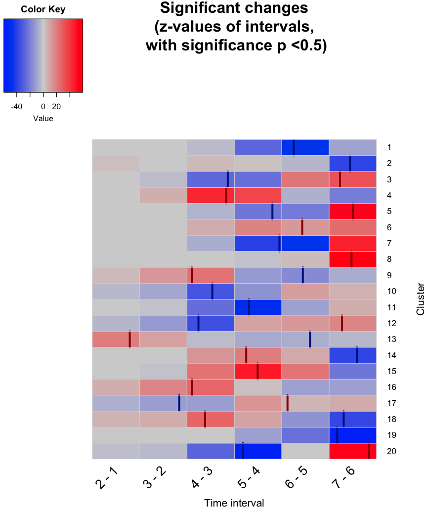
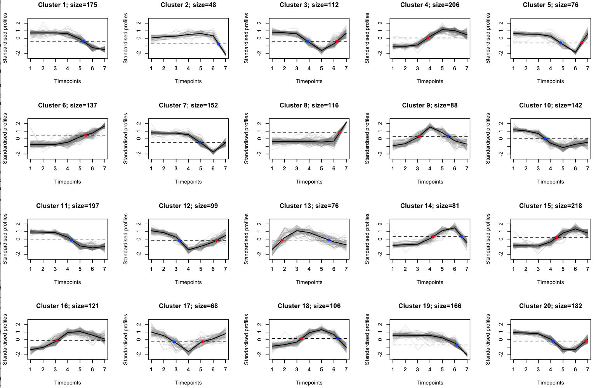
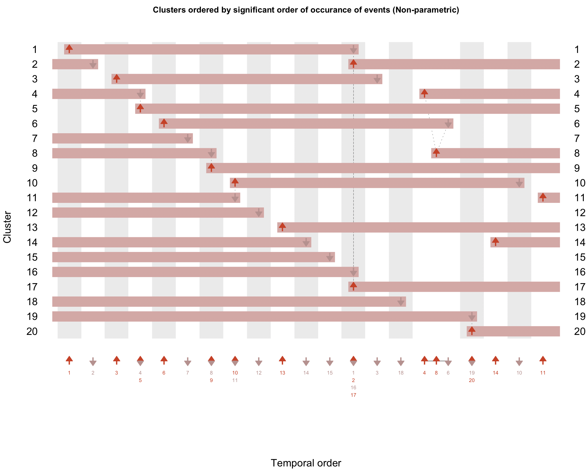
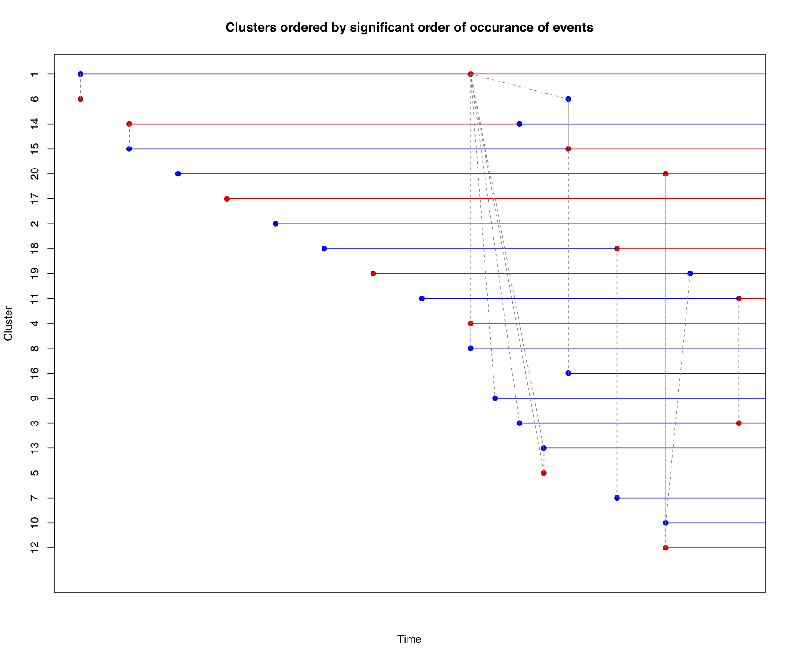

# Demonstration on Gene Expression dataset

In this document, we demonstrate how our package can be utilised to order gene expression clusters.

### Dataset

We utilise the dataset made available by Ma *et al.* [1]. We downloaded the raw data from GEO (Gene Expression Omnibus) with the identifier GSE40565 and considered only the time-series arrays. We then obtained the differentially expressed genes from the seven time points (including basal) by following the section 'Microarray analysis' in Ma *et al.* [1]. This resulted in 2,566 profiles, which we make available as a sample dataset in this package.  

### Workflow

The work flow is very similar to the workflow for the time-series phosphoproteomics datasets.

#### 1. Load the dataset and standardise it

```R
# Load the data.
data(ge)


# Standardisation
tmp <- sweep(ge.temporal.changed, 1, apply(ge.temporal.changed, 1, mean), FUN="-")
ge.stand <- sweep(tmp, 1, apply(ge.temporal.changed, 1, sd), FUN="/")
ge.stand <- as.matrix(ge.stand)
remove(tmp)
```

#### 2. Clustering using Mfuzz

```R
library(Mfuzz)

clustered <- cmeans(ge.stand, centers=20,  iter.max=200, m=1.25) # paper, 2014_ma_etal, says 20 clusters.

# Plotting the clusters
plotClusters(ge.stand, clustered)
```


Fig. 1: Clusters of gene expression dataset.  


#### 3. Quantifying change within clusters

Change within a cluster at the various time intervals can be quantified as follows:

```R
# Create and run, for each cluster, a generalised linear model and carry out tukey post-hoc evaluations.
glmTukeyForEachClus <- calcClusterChng(ge.stand, clustered)

# Extract z-scores and p-values.
glmTukeyForEachClus.summary <- summaryGetZP(glmTukeyForEachClus, totalTimePoints=7)

## Plot the z-scores as a heatmap.
resWithOnlySignif <- plotZP(glmTukeyForEachClus.summary)
```

Fig. 2: Heatmap showing z-scores for each of the clusters (x-axis) at time-intervals (y-axis) with significant p-values. Z-scores at non-significant intervals are shown in grey.


#### 4. Calculate events

```R
# Calculate 50% crossings (time and direction at the 50% abundance)
mat_fiftyPoints <- calc50crossing(clustered)


# Overlaying the 50% crossings on the heat map.
plotZP_fifty(glmTukeyForEachClus.summary, mat_fiftyPoints)
```


Fig. 3: Heatmap with 50% crossing points overlaid

```R
# Overlaying the 50% crossings on the cluster plot.
plotClusters_fifty(ge.stand, clustered, mat_fiftyPoints)
```


Fig. 4: Cluster plots with phosphorylation and dephosphorylation events marked marked, in red and blue respectively.


#### 5. Ordering events


```R
# Non-parametric test based ordering
mat_fiftyPts_withOrder <- orderTheEvents(ge.stand, clustered, mat_fiftyPoints, test="wilcox")
```

Fig. 5: Clusters ordered by first event (where the event ordering was calculated non-parametrically). The events (depicted by dots) which are connected via red dashed lines do not occur at significantly different times.


```R
# Parametric test based ordering
mat_fiftyPts_withOrder <- orderTheEvents(ge.stand, clustered, mat_fiftyPoints, test="t-test")
```


Fig. 6: Clusters ordered by first event (where the event ordering was calculated parametrically). Similarly to Fig. 5, those events which are connected via red dashed lines do not occur at significantly different times.


As a side note, generated images can be saved as pdf and the width and height adjusted:

```R
pdf("ge_dups_wilcox.pdf", width = 16, height=4)
plotClusters(ge.stand, clustered)
dev.off()
```


References

1. Ma, X., Yang, P., Kaplan, W.H., Lee, B.H., Wu, L.E., Yang, J.Y.H., Yasunaga, M., Sato, K., Chisholm, D.J. and James, D.E., 2014. ISL1 Regulates Peroxisome Proliferator-Activated Receptor gamma Activation and Early Adipogenesis via Bone Morphogenetic Protein 4-Dependent and-Independent Mechanisms. *Molecular and cellular biology*, 34(19), pp.3607-3617.
